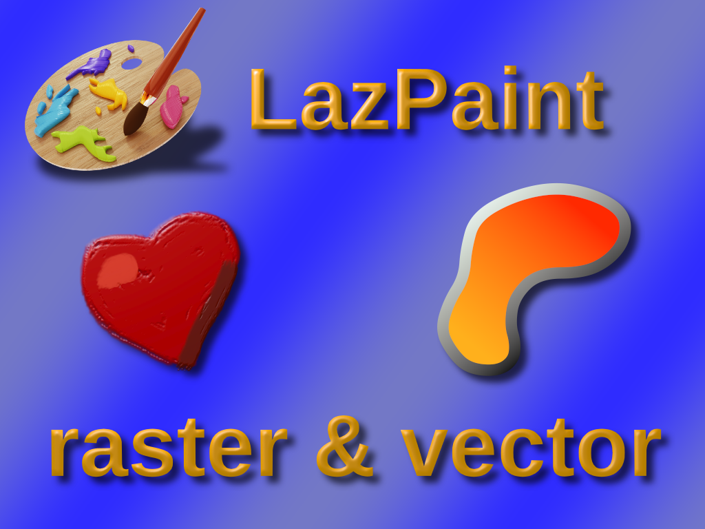
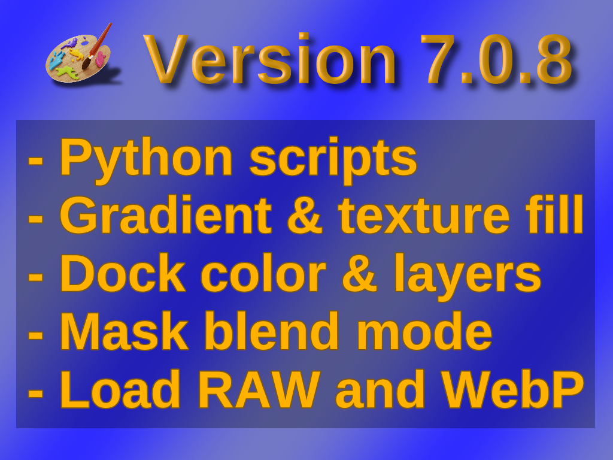

# LazPaint

LazPaint is an opensource image editing software completely written in FreePascal. It handles layered images, blend modes and can read/write OpenRaster format for exchange. Various filers and color adjustements can be applied to a selected portion of the image.

It is possible as well to add shapes that are stored as vectors. They can be modified later on. The raster content is also treated as a vector shape that can be moved around and transformed. You can seemlessly paint as with a raster software and add text or polygons on top of that.

Latest version can run Python scripts. Some are installed by default and provide layer effects: drop shadow, color overlay, split channels.

The graphic library BGRABitmap is also opensource and can be used in any FreePascal project. More information on it can be found on the Lazarus forum.

---

## Slide 0

On the left, a drawing with the brush with a Phong effect ; on the right a vector shape filled with gradients.

---

## Slide 1

Here are new features of the latest version. More features are planned:
- Lab color curves adjustement
- Gradients with more than 2 colors
- Multiple selection of shapes
- More layer effects

---

## Presence at the LGM

- Johann ELSASS, developer of LazPaint and BGRABitmap

## Further links

- Dicussion: https://forum.lazarus.freepascal.org/index.php/board,46.0.html
- Code: https://github.com/bgrabitmap/lazpaint

A list of links to relevant news that the participants of the LGM to know more about what happened last year in your project:

- https://github.com/bgrabitmap/lazpaint/releases
- https://www.facebook.com/LazPaint/
