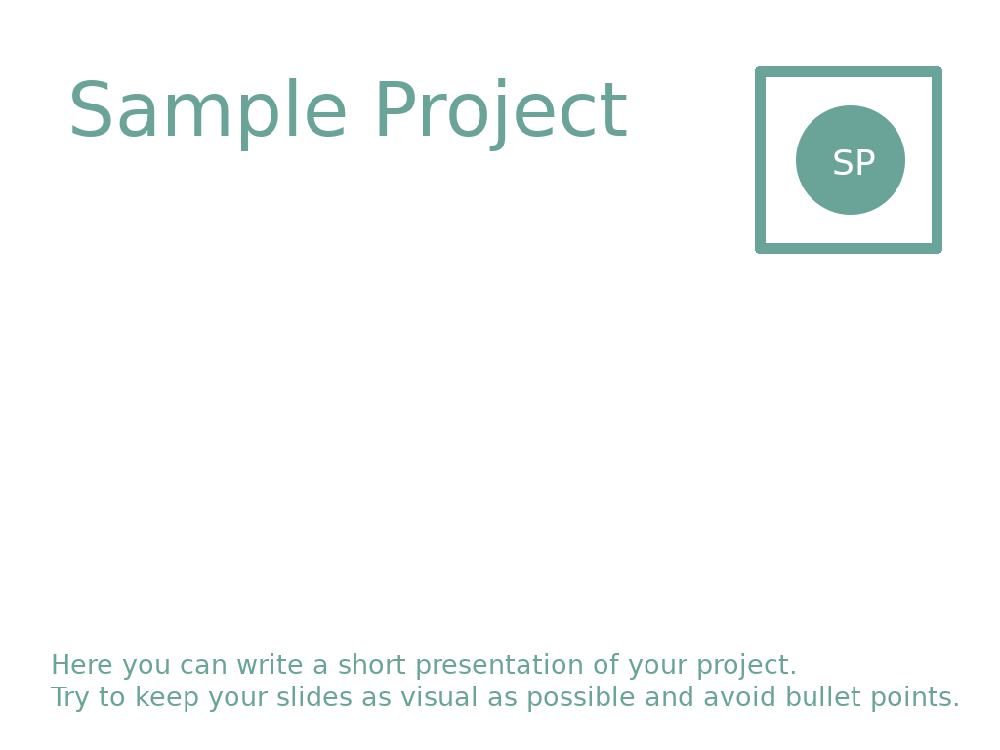
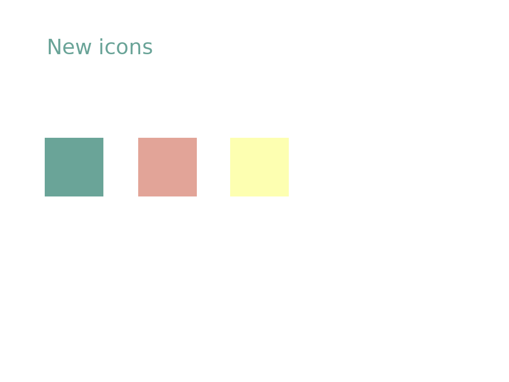

# Sample project

This file will contain the speaker's notes.

The speaker's notes should provide to the speaker the information to fill about 60 to 90 seconds.

Please, replace the content of this file with the information about what happened in your project since the last LGM.

---

## Slide 0

Introductory Slide: Just an image (Logo and or general screenshot, ...)

Add one sentence in here that describes what your project does.

---

## Slide 1

Tell what your project did last year and/or what are the plans for next year.

---

## Presence at the LGM

If you're at the LGM please list the project's people (names or number of) who are present at the LGM and the talks / activities that you will be proposing.

- ...

## Further links

- Website: <http://sample-project.org>
- Dicussion: <http://sample-project.org>
- Code: <http://sample-project.org>

A list of links to relevant news that the participants of the LGM to know more about what happened last year in your project:

- [Discovering 4D Grids](https://example.com/4d-grids)
- <https://example.com/1-0-relased.html>
